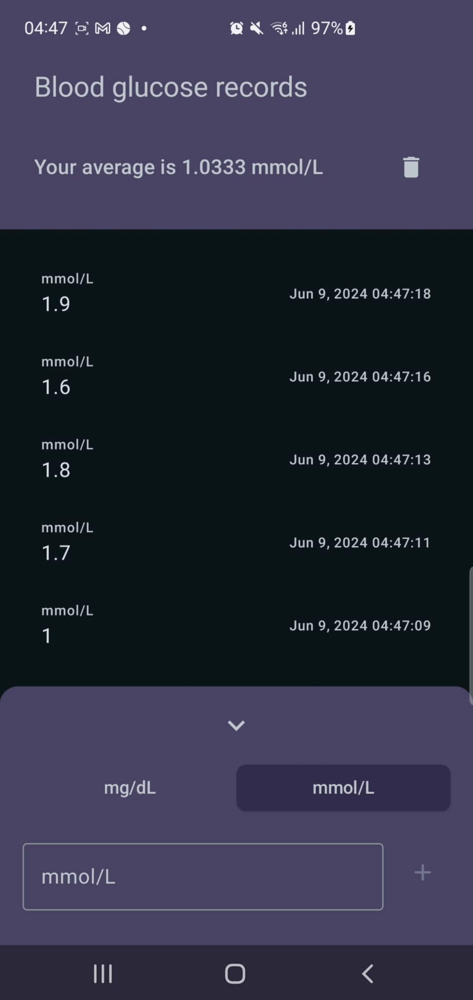

# Mini logbook

## Objective:
Application to keep track of blood glucose values and calculate the average

## Features:
* The user can input blood glucose values using a text field
* The values are only numeric and are validated with the device language format
* The blood glucose average is calculated and updated after each value is added
* The record values are persisted in a local database
* The record list displays a maximum of the last 100 records
* Each record displays its value, the date added, and the measure unit
* The supported measure units are mmol/L and mg/dL
* If the user changes the measure unit, all the values are changed instantly, including the displayed records and the one on the input text field
* The user can clear the list from the top menu by deleting all the stored values
* If there are no records, an empty state with a message is displayed
* If there are no records, the component to display the average is hidden
* If any error occurs, an error state with a message is displayed on the list
* A loading state is displayed while loading the values
* The conversion factor for blood glucose is 1 mmol/L = 18.0182 mg/dL

## Design and architecture:
* The project is based on a layered architecture composed of a data, domain, and UI layer
* The information follows the unidirectional data flow pattern: data flows from layers data->domain->ui (dataSource->repositories->useCases->viewmodels->ui) and events go the other way ui->domain->data
* The data stream is implemented with flow
* The presentation layer is implemented using MVVM
* There are several use cases defined to handle data conversion that are generic enough to be reused in other future features of the application's viewmodels

## Libraries
* Dependency injection using Hilt
* Database uses Room
* All the UI was created in Compose

## Models
* There are data models defined for each layer used to communicate data with the layers below
  * DataSource - Entities
  * Repositories - Models
  * ViewModels - UIState

## Storage
* The data source component was implemented with Room and is used by default
* There is also an in-memory storage implementation but it is not currently used
* Records are always stored as mg/dL and converted upon display if required
* Dates are stored in UTC and converted to the local device time zone on load from the database
* There are two entities defined in the database - Record and Overview
* Record contains an individual blood glucose entry value and the date
* Overview holds the calculated values after a record is added. This avoids requesting all database values on each record addition to calculate the average
* Currently, there is only one Overview object in the database, but having the table ready will allow support for multiple users in the future

## Repository
* Is stateless
* It abstracts communication with the data source
* Calculates the average
* Handles model conversion

## ViewModel
* Is the state holder of uiState
* Handles subscription to repositories
* Handles user input and events
* Uses the domain layer to validate and convert data to be displayed on the UI depending on the filter selected and the device language
* Handles and displays errors
* The user can use the keyboard next button to add several values without hiding the keyboard
* Using the + button will always hide the keyboard

## Languages
* The available languages are English and Spanish

## Future improvements
* The record list can be paginated to display more than 100 records
* The maximum value supported for the average is the int capacity for the system. This can be increased using long if required
* Add features to remove a specific item

## App preview

